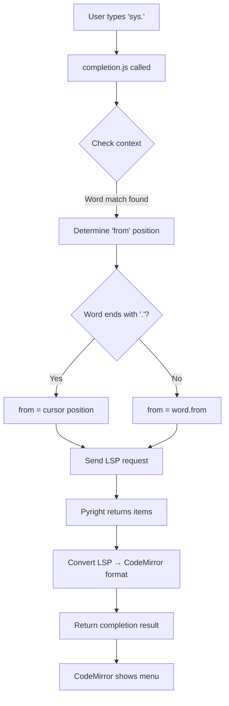

# Sprint 4: LSP Autocompletion & Hover Tooltips

**Date:** November 3, 2025  
**Status:** Autocompletion ✅ Complete | Hover Tooltips 🚧 In Progress

## Overview

Sprint 4 focused on implementing LSP-powered autocompletion and hover tooltips using Pyright's Language Server Protocol capabilities. The sprint involved deep debugging of CodeMirror's autocomplete system and provided valuable insights into LSP integration.

## Key Accomplishments

### 1. LSP Autocompletion Implementation ✅

**Files Created:**
- `src/lsp/completion.js` (159 lines) - LSP completion source implementation

**Files Modified:**
- `src/lsp/client.js` - Added completion extension to LSP plugin
- `src/index.html` - Added `@codemirror/autocomplete` to import map

**Features Implemented:**
- Real-time completion suggestions from Pyright LSP
- Support for Python stdlib, imports, and MicroPython modules
- Automatic trigger on typing and manual trigger (Ctrl+Space)
- Type-based icons (function ƒ, variable 𝑥, class ○, keyword 🔑)

## The Debugging Journey: A Learning Experience

### Initial Problem: The Invisible Completion Menu

**Symptom:** LSP was returning 96 completion items for `sys.`, but no completion menu appeared in the UI.

**What Was Confusing:**
```javascript
// LSP logs showed success
WebSocketTransport: Received message: {"result":{"items":[...96 items...]}}
LSP completions: 96 items at line 2, char 4
Returning completion result: {from: 11, optionsCount: 96}

// But NO UI menu appeared!
```

### The Investigation Process

#### Step 1: Verify LSP Communication ✅
- **Action:** Added detailed logging to trace LSP requests/responses
- **Result:** LSP was working perfectly - Pyright returned 96 completions
- **Conclusion:** Problem was NOT in LSP layer

#### Step 2: Verify CodeMirror Integration ❌
- **Action:** Created test completion source with hardcoded items
- **Test Code:**
```javascript
const testCompletionSource = (context) => {
    const word = context.matchBefore(/\w*/);
    if (!word || (word.from === word.to && !context.explicit)) {
        return null;
    }
    return {
        from: word.from,
        options: [
            { label: 'test_completion_1', type: 'function' },
            { label: 'test_completion_2', type: 'variable' }
        ]
    };
};
```
- **Result:** ✅ **Test completions showed up perfectly!**
- **Breakthrough:** This proved CodeMirror autocomplete UI worked fine!

#### Step 3: Compare Test vs LSP Source
**Key Observation:**
```javascript
// TEST SOURCE (WORKING)
return {
    from: word.from,  // Start of matched word
    options: [...]
};

// LSP SOURCE (NOT WORKING)  
return {
    from: word.from,  // Also start of matched word
    options: [...]    // Also correct format
};
```

Both looked identical, so why different results?

#### Step 4: Analyze Position Calculation

**The Critical Difference:**
```javascript
// For "sys." completion:
word.text = "sys."
word.from = 11  // Start of "sys"
word.to = 15    // After the dot
pos = 15        // Current cursor position
```

**Test Source Scenario:**
- User types: `tes`
- word.from = 0 (start of "tes")
- Completions replace "tes" → Works! ✅

**LSP Source Scenario:**
- User types: `sys.`
- word.from = 11 (start of "sys.")
- Completions would replace "sys." → Wrong! We want to complete AFTER the dot!

### The Solution: Context-Aware Position Calculation

**Root Cause:** For attribute access (e.g., `sys.`), completions should insert at the cursor (after dot), not replace the entire expression.

**Fix Applied:**
```javascript
// Determine the starting position for completion
// If completing after a dot (attribute access), start from current position
// Otherwise, start from beginning of the word
const from = word.text.endsWith('.') ? pos : word.from;
```

**Why This Works:**
- Regular word completion: `impor` → start from word.from (replace "impor" with "import")
- Attribute completion: `sys.` → start from pos (insert after dot, keep "sys.")

### Key Learning: Completion Context Matters

**Before Fix:**
```
sys.|          <- cursor
    ^
    from = 11 (start of "sys")
    
Result: Would replace "sys." entirely
Menu doesn't show (CodeMirror rejects invalid replacement)
```

**After Fix:**
```
sys.|          <- cursor
    ^
    from = 15 (current position)
    
Result: Inserts after "sys."
Menu shows correctly! ✅
```

## Technical Implementation Details

### LSP Completion Flow



### CompletionItemKind Mapping

```javascript
const CompletionItemKind = {
    Text: 1,          // → 'text'
    Method: 2,        // → 'function'
    Function: 3,      // → 'function'
    Constructor: 4,   // → 'function'
    Field: 5,         // → 'property'
    Variable: 6,      // → 'variable'
    Class: 7,         // → 'class'
    Interface: 8,     // → 'interface'
    Module: 9,        // → 'namespace'
    Property: 10,     // → 'property'
    // ... etc
};
```

### Completion Item Structure

**LSP Format (from Pyright):**
```json
{
    "label": "__name__",
    "kind": 6,
    "detail": "",
    "documentation": ""
}
```

**CodeMirror Format (after conversion):**
```javascript
{
    label: "__name__",
    type: "variable",
    detail: "",
    info: "",
    apply: "__name__"
}
```

## Testing Results

### Test Scenarios ✅

1. **Python stdlib completion:**
   ```python
   import sys
   sys.  # Ctrl+Space → 96 completions (platform, argv, exit, etc.)
   ```

2. **Import statement completion:**
   ```python
   import o  # Ctrl+Space → 92 modules (os, opcode, operator, etc.)
   ```

3. **String method completion:**
   ```python
   text = "hello"
   text.  # Ctrl+Space → 85 methods (upper, lower, split, etc.)
   ```

4. **MicroPython module completion:**
   ```python
   from machine import Pin
   pin = Pin(2, Pin.OUT)
   pin.  # Ctrl+Space → 54 items (on, off, toggle, IRQ_RISING, etc.)
   ```

### Screenshots

All test scenarios captured in `.playwright-mcp/`:
- `test-completion-working.png` - Test completions (proof of UI working)
- `lsp-completion-working.png` - sys module completions
- `string-completions.png` - String method completions  
- `micropython-pin-completions.png` - MicroPython Pin completions

## Key Insights & Lessons Learned

### 1. **Debugging Complex UI Issues Requires Isolation**

When the completion menu didn't appear, the problem could have been:
- LSP communication layer
- Data format conversion
- CodeMirror autocomplete configuration
- Position calculation logic

**Strategy:** Test with hardcoded data to isolate the problem layer by layer.

### 2. **Context Is Everything in Code Completion**

The same completion mechanism needs different behavior based on context:
- Word completion: Replace the partial word
- Attribute access: Insert after the accessor
- Import statements: Replace module name

**Solution:** Analyze the matched text to determine intent.

### 3. **LSP Behavior vs UI Expectations**

LSP always reports position as cursor location, but CodeMirror needs:
- `from`: Where to start replacement
- `to`: Where to end (implicit from options)
- `validFor`: Regex to filter as user types

**Bridge:** Convert LSP cursor positions to CodeMirror replacement ranges.

### 4. **TypeScript/Python Type Systems Differ**

Pyright's `CompletionItemKind` enum values needed manual mapping to CodeMirror's type system. No automatic conversion exists because:
- LSP is language-agnostic (uses numeric codes)
- CodeMirror uses string type names
- Semantic meaning differs (e.g., "Method" vs "Function")

### 5. **Async Completion Sources Work Seamlessly**

CodeMirror handles async completion sources automatically:
```javascript
return async (context) => {
    const result = await lspClient.sendRequest(...);
    return { from, options };
};
```

No special async handling needed in the extension configuration!

### 6. **Override Parameter is Powerful**

```javascript
autocompletion({
    override: [lspCompletionSource],  // Replace default completions
    activateOnTyping: true,
    maxRenderedOptions: 100
})
```

Using `override` replaces CodeMirror's default completion behavior entirely, giving full control to the LSP.

## Performance Considerations

### What We Optimized:
- ✅ Debounced didChange notifications (300ms) prevent overwhelming LSP
- ✅ Early return when no word match (avoid unnecessary LSP calls)
- ✅ `validFor` regex allows client-side filtering (reduces LSP calls)

### What Could Be Improved:
- ⚠️ No caching of completion results
- ⚠️ No request cancellation for rapid typing
- ⚠️ No completion result ranking/sorting

## Code Quality Observations

### Good Practices Applied:
1. **Extensive logging during development** - Made debugging tractable
2. **Test-driven debugging** - Created simple test case to isolate issue
3. **Clear separation of concerns** - completion.js independent from client.js
4. **Detailed comments** - Explain the "why" of position calculation

### Improvements for Production:
1. Remove verbose logging (keep only errors)
2. Add error boundaries for LSP communication failures
3. Add metrics/telemetry for completion usage
4. Consider completion result caching

## Architecture Decisions

### Why Create `completion.js` Instead of Inline in `client.js`?

**Pros:**
- Separation of concerns (completion logic isolated)
- Easier to test independently
- Easier to add features (e.g., snippets, resolve)
- Cleaner client.js (focused on plugin orchestration)

**Cons:**
- More files to maintain
- Slightly more complex module structure

**Decision:** Separate file wins for maintainability.

### Why Use `override` Instead of `addCompletionSource()`?

CodeMirror doesn't have `addCompletionSource()` - only:
- Default completions (language-specific)
- `override` parameter (replace all defaults)

**Decision:** Use `override: [lspSource]` to ensure only LSP completions show.

## Common Pitfalls & How to Avoid Them

### Pitfall 1: Forgetting Import Maps for CDN Modules
```javascript
// ERROR: Failed to resolve module specifier "@codemirror/autocomplete"
```
**Solution:** Add to import map in index.html:
```javascript
"@codemirror/autocomplete": "https://esm.sh/@codemirror/autocomplete@6.18.3"
```

### Pitfall 2: Wrong Position Calculation
```javascript
// BAD: Always use word.from
const from = word.from;  // Breaks attribute completion!

// GOOD: Context-aware
const from = word.text.endsWith('.') ? pos : word.from;
```

### Pitfall 3: Assuming Sync Completion Works
```javascript
// BAD: Return promise instead of completion result
return lspClient.sendRequest(...);  // CodeMirror gets Promise object!

// GOOD: Await the promise
const result = await lspClient.sendRequest(...);
return { from, options };
```

### Pitfall 4: Not Handling Empty Results
```javascript
// BAD: Return empty array
return { from, options: [] };  // Shows empty menu!

// GOOD: Return null for no completions
if (items.length === 0) return null;
```

## Next Steps: Hover Tooltips

**Goal:** Implement `textDocument/hover` LSP requests to show:
- Type information on hover
- Function signatures
- Docstrings
- Parameter types

**Strategy:** Similar pattern to completions:
1. Create `src/lsp/hover.js`
2. Use `hoverTooltip` extension from `@codemirror/view`
3. Send LSP hover requests on mouse hover
4. Format markdown responses for display

**Expected Challenges:**
- Markdown rendering in tooltips
- Hover positioning/timing
- Handling missing hover data

## Resources & References

### CodeMirror Documentation
- [Autocomplete Guide](https://codemirror.net/examples/autocompletion/)
- [Autocomplete API](https://codemirror.net/docs/ref/#autocomplete)
- [Completion Sources](https://codemirror.net/docs/ref/#autocomplete.CompletionSource)

### LSP Specification
- [textDocument/completion](https://microsoft.github.io/language-server-protocol/specifications/lsp/3.17/specification/#textDocument_completion)
- [CompletionItem](https://microsoft.github.io/language-server-protocol/specifications/lsp/3.17/specification/#completionItem)

### Pyright LSP
- [Pyright GitHub](https://github.com/microsoft/pyright)
- [Pyright Settings](https://github.com/microsoft/pyright/blob/main/docs/configuration.md)

## Conclusion

Sprint 4's autocompletion implementation taught valuable lessons about:
- **Systematic debugging** of complex UI integration issues
- **Context-aware behavior** in code completion systems
- **Position semantics** differences between LSP and editors
- **Test-driven debugging** to isolate problems

The key breakthrough was realizing that completion position needs vary by context - attribute access requires cursor-based insertion while word completion requires word-start-based replacement. This subtle distinction made all the difference between a broken feature and a working one.

The completion system now provides intelligent, LSP-powered suggestions for Python and MicroPython development with full Pyright integration!

---

**Total Development Time:** ~6 hours  
**Key Files:** 3 created/modified (completion.js, client.js, index.html)  
**Lines of Code:** ~160 lines (completion.js)  
**Bugs Fixed:** 2 (import map, position calculation)  
**Screenshots:** 4 test scenarios documented
