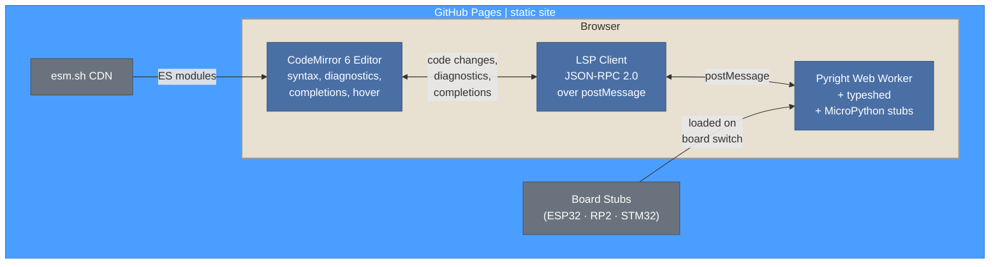
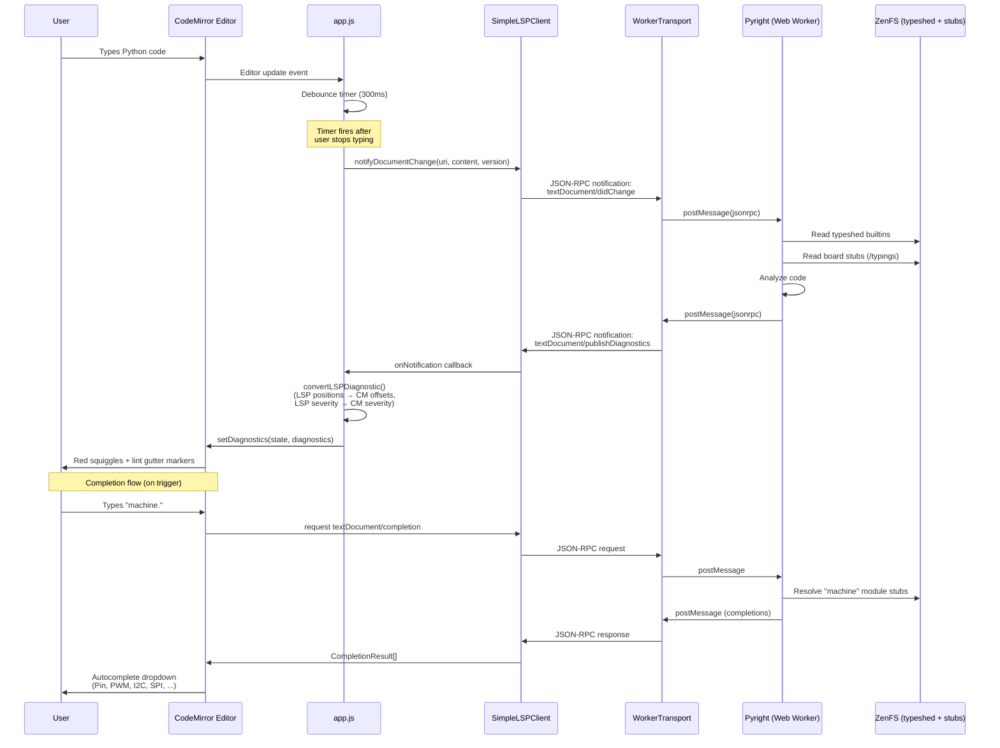
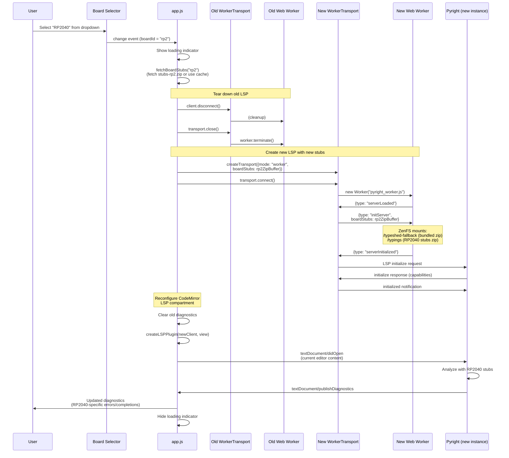
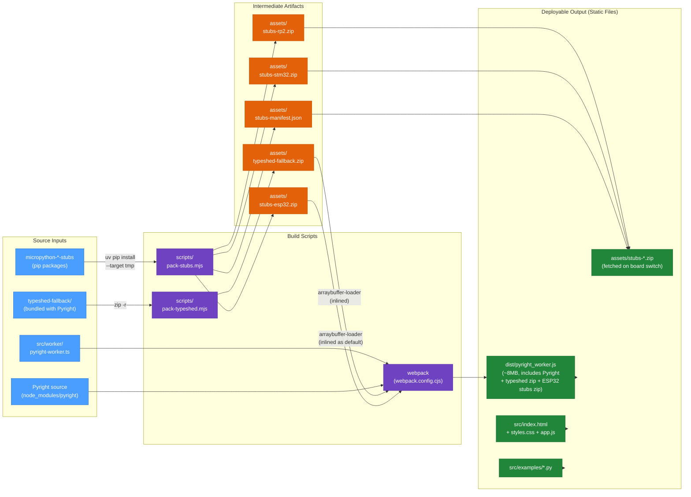

# Architecture

This document describes the architecture of the MicroPython CodeMirror Editor — a static HTML5 page that runs Pyright as an LSP server entirely in the browser via a Web Worker, providing real-time diagnostics, autocompletion, and hover tooltips for MicroPython code. The page is deployable to GitHub Pages with zero server-side dependencies.

## Component Overview

Everything runs in the browser. CodeMirror handles the editing UI, an LSP client bridges it to Pyright running in a Web Worker, and Pyright uses bundled type stubs to understand MicroPython code.

For implementation details, see the source files: `src/lsp/` (client layer), `src/worker/pyright-worker.ts` (worker entry), and `src/app.js` (editor setup and board switching).

## LSP Communication Flow

When the user types code in the editor, changes are debounced and sent to Pyright via the LSP protocol over `postMessage`. Pyright analyzes the code against typeshed and board stubs, then pushes diagnostics back. The LSP client maps these to CodeMirror lint markers that appear as red squiggles.

## Board Switch Flow

When the user selects a different board (e.g., ESP32 → RP2040), the current worker is terminated and a new one is created with the target board's stubs. The LSP lifecycle restarts from scratch — initialize, open document, and diagnostics refresh.

## Build Pipeline

The build process bundles Pyright, typeshed, and default board stubs into a single worker JS file. Board stub zips are also produced as separate files for on-demand loading.

**Key details:**
- **typeshed-fallback.zip** and **stubs-esp32.zip** are inlined into the worker bundle via `arraybuffer-loader`, so the default board works with zero additional fetches.
- Non-default board stubs (RP2, STM32) are fetched on demand and cached in memory (`stubsCache` Map).
- The webpack config targets `webworker`, polyfills Node APIs (fs → ZenFS, path, crypto, etc.), and uses `ts-loader` in transpile-only mode.
- `fs` is aliased to `@zenfs/core` so Pyright's filesystem calls work against the in-browser virtual filesystem.
